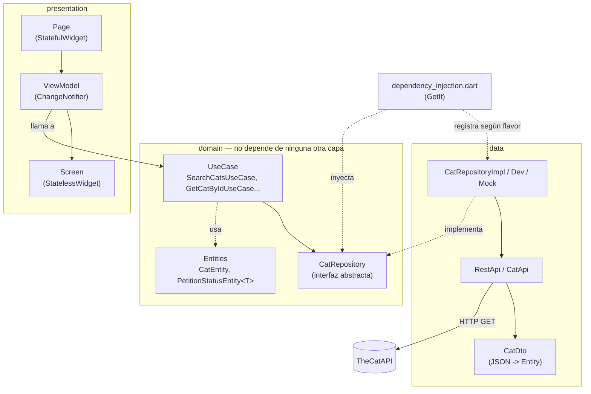

# Pragma Catbreeds

App Flutter que consume [TheCatAPI](https://thecatapi.com/) para buscar razas de gatos y ver el detalle de cada una (origen, temperamento, esperanza de vida, nivel de inteligencia/adaptabilidad/afecto, etc.), con paginación infinita, búsqueda con debounce e internacionalización.

Proyecto de prueba técnica construido con **Clean Architecture** (domain / data / presentation), MVVM en la capa de presentación e inyección de dependencias con `get_it`.

## Requisitos

- Flutter `3.47.4` (canal stable) — Dart SDK `^3.13.3`
- Un API key de [TheCatAPI](https://thecatapi.com/) para los flavors `dev`/`prod`

## Puesta en marcha

1. Instalar dependencias:

   ```bash
   flutter pub get
   ```

2. Crear un archivo `.env` en la raíz del proyecto con tu API key:

   ```
   CAT_API_KEY=tu_api_key_de_thecatapi
   ```

   El flavor `mock` no la necesita (usa datos falsos, no llama a la API real).

3. Correr el flavor que necesites (ver [Flavors](#flavors) abajo).

## Arquitectura

El código en `lib/` está organizado en tres capas, siguiendo la regla de dependencia de Clean Architecture: `domain` no conoce a `data` ni a `presentation`; las otras dos capas dependen de `domain`, nunca al revés.



```
lib/
├── domain/           # Reglas de negocio puras, sin Flutter ni HTTP
│   ├── entities/      # CatEntity, SearchResultEntity<T>, PetitionStatusEntity<T>...
│   ├── repositories/  # Contratos abstractos (CatRepository, LocalizationRepository)
│   ├── use_cases/     # Un caso de uso = una operación de negocio (SearchCatsUseCase...)
│   ├── states/        # Contratos de estado transversal (LocalizationState)
│   └── contstants/    # Claves de error compartidas (ErrorsConstants)
│
├── data/             # Implementación concreta de los contratos de domain
│   ├── repositories/  # Implementaciones por flavor (Impl / Dev / Mock) de cada repo
│   ├── dtos/           # Mapeo JSON -> Entity (CatDto.fromJSON)
│   └── settings/       # Cliente HTTP base (RestApi) y su configuración por API (CatApi)
│
├── presentation/     # UI + estado de UI, con Provider como mecanismo de notificación
│   ├── ui/pages/       # Cada pantalla: Page (StatefulWidget) + Screen (UI) + ViewModel
│   ├── ui/widgets/      # Widgets reutilizables (loaders, imágenes con caché, etc.)
│   ├── ui/utils/        # ViewModel base + adaptador para conectarlo a Provider
│   ├── ui/theme/        # Temas claro/oscuro
│   └── states/          # Implementación concreta de LocalizationState
│
├── flavors/          # Definición de los flavors (mock/dev/prod)
└── dependency_injection.dart  # Registro de todo en GetIt, varía según el flavor activo
```

### Patrón de cada pantalla (Page / Screen / ViewModel)

Con la intención de tener los widgets separados de sus funciones en la vista, cada pantalla se divide en tres archivos con una responsabilidad única:

- **`*_page.dart`**: `StatefulWidget` que solo crea el `ViewModel` (vía `StfViewModelAdapter`) y lo inyecta con `Provider`.
- **`*_page_view_model.dart`**: extiende `ViewModel<T>` (un `ChangeNotifier`), llama a los `UseCase` correspondientes y expone el estado a la UI.
- **`*_page_screen.dart`**: `StatelessWidget` puro que lee el `ViewModel` con `context.watch<T>()` y solo dibuja UI — no conoce casos de uso ni repositorios.

`StfViewModelAdapter` ([stf_view_model_adapter.dart](lib/presentation/ui/utils/stf_view_model_adapter.dart)) es el pegamento que evita repetir el boilerplate de `ChangeNotifierProvider` + `Consumer` en cada pantalla.

### Manejo de resultados asíncronos: `PetitionStatusEntity<T>`

En vez de exponer `Future<T>` crudo, los repositorios devuelven `PetitionStatusEntity<T>` ([petition_status_entity.dart](lib/domain/entities/petition_status_entity.dart)): un wrapper con `status` (`loading` / `complete` / `failed` / `notStarted`), `data` y `error`. Esto permite que la UI represente los cuatro estados de una petición de forma explícita, sin `FutureBuilder`s repetidos por pantalla.

`LoaderScreenWidget<T>` ([loader_screen_widget.dart](lib/presentation/ui/widgets/loaders_status/loader_screen_widget.dart)) es el widget que traduce ese estado en UI (loading / error con retry / sin resultados / contenido). Su `builder` recibe el dato **ya desenvuelto y no nulo** (`Widget Function(BuildContext, T data)`), así las pantallas nunca hacen `data!`.

### Manejo de errores

La clasificación de errores de transporte (timeout, sin internet, 401, 404, etc.) vive únicamente en la capa `data` ([rest_api.dart](lib/data/settings/rest_api.dart)), que traduce excepciones de red a claves de [`ErrorsConstants`](lib/domain/contstants/errors_constants.dart). El dominio (`PetitionStatusEntity.fromError`) no conoce `SocketException`, `TimeoutException` ni códigos HTTP — solo sabe formatear un estado de error a partir de una clave ya clasificada, con fallback a un error genérico traducible para no filtrar texto de excepciones crudas a la UI.

## Widgets de carga y estados: siempre una experiencia amigable

Una decisión de diseño que se repite en toda la app: **ninguna pantalla debería mostrarle al usuario una pantalla en blanco, un ícono de imagen rota, o un stacktrace crudo mientras algo carga o falla.** Para eso, cualquier pantalla que dependa de una petición (a la API o a un asset) se apoya siempre en los mismos widgets de estado, en vez de que cada pantalla improvise su propio loading/error:

- **`LoaderScreenWidget<T>`** ([loader_screen_widget.dart](lib/presentation/ui/widgets/loaders_status/loader_screen_widget.dart)) es el punto de entrada: recibe un `PetitionStatusEntity<T>` y decide sola cuál de los siguientes widgets mostrar, sin que la pantalla que lo usa tenga que escribir esa lógica.
- **`LoadingWidget`** ([loading_widget.dart](lib/presentation/ui/widgets/loaders_status/loading_widget.dart)): estado de carga. En vez de un `CircularProgressIndicator` pelado, combina el spinner con una animación Lottie (`SplashLoadingLottieWidget`) para que la espera se sienta parte de la identidad visual de la app y no un simple "cargando..." genérico.
- **`ErrorLoadingWidget`** ([error_loading_widget.dart](lib/presentation/ui/widgets/loaders_status/error_loading_widget.dart)): estado de error. Nunca expone el error técnico crudo — muestra el mensaje ya traducido (viene clasificado desde `data`, ver [Manejo de errores](#manejo-de-errores)) junto a un botón de **reintentar** (`onRetry`), para que el usuario siempre tenga una salida y no un callejón sin salida.
- **`NoResultsWidget`** / **`NoResultsSmallWidget`** ([no_results_widget.dart](lib/presentation/ui/widgets/loaders_status/no_results_widget.dart) / [no_results_small_widget.dart](lib/presentation/ui/widgets/loaders_status/no_results_small_widget.dart)): estado de "sin resultados" (búsqueda vacía, lista vacía). Existen dos tamaños — uno de pantalla completa con la animación Lottie, y una versión compacta con ícono SVG para espacios reducidos — pero ambos siguen el mismo principio: título + mensaje + acción, nunca un espacio vacío sin contexto.

Estos tres widgets comparten la misma animación (`SplashLoadingLottieWidget`) y los mismos componentes de texto/botón (`ButtonWidget`), así que loading, error y "sin resultados" se sienten como partes de un mismo lenguaje visual en toda la app, en lugar de tres estilos distintos según qué pantalla los dispare.

### Imágenes: nunca un ícono de imagen rota

El mismo principio aplica a cada imagen de red que se pinta en la UI (fotos de gatos en `CatCardWidget` y en el detalle). **`ImageNetworkWithLoadWidget`** ([image_network_with_load_widget.dart](lib/presentation/ui/widgets/images/image_network_with_load_widget.dart)) envuelve `Image.network` para manejar sus tres estados explícitamente en vez de dejarle a Flutter su comportamiento por defecto:

- **Cargando**: un placeholder gris con `CircularProgressIndicator` mientras se descarga.
- **Error o sin imagen** (`errorBuilder`, o cuando no hay `imageUrl`): en vez del ícono roto por defecto de Flutter, muestra una imagen por defecto configurable (`defaultImage`) o, si no hay ninguna, un placeholder neutro — la tarjeta de un gato nunca se ve "rota" aunque la URL falle o la raza no tenga foto.
- **Éxito**: la imagen real, con soporte opcional de caché en disco (`flutter_cache_manager`, vía `useCache`) para no re-descargar la misma foto cada vez que la tarjeta vuelve a construirse (por ejemplo, al hacer scroll hacia atrás en la lista paginada).

## Flavors

El proyecto usa `flutter_flavorizr` con tres flavors, cada uno con su propio `applicationId`/`bundleId` y nombre de app:

| Flavor | Repositorios usados | Uso |
|---|---|---|
| `mock` | `CatRepositoryMock`, `LocalizationRepositoryMock` | Desarrollo de UI sin backend, datos falsos e instantáneos |
| `dev` | `CatRepositoryDev` (TheCatAPI real) | Desarrollo conectado a datos falsos en las apis no conectadas, y a los reales en la conectada, además se puede usar para tener un diferente back de DEV |
| `prod` | `CatRepositoryImpl` (TheCatAPI real) | Build para producción solo usa datos reales |

El flavor activo se lee en runtime desde la variable global `appFlavor` de `package:flutter/services.dart`, que Flutter puebla automáticamente (vía `--dart-define=FLUTTER_APP_FLAVOR`) al usar `--flavor` — no hace falta pasarla a mano. Ese valor determina qué implementación registra [`DependencyInjection`](lib/dependency_injection.dart) en `GetIt`, así cada capa superior solo depende de las interfaces de `domain`, nunca sabe qué implementación concreta está corriendo.

Correr cada flavor:

```bash
flutter run --flavor mock -t lib/main.dart
flutter run --flavor dev -t lib/main.dart
flutter run --flavor prod -t lib/main.dart
```

También hay configuraciones equivalentes en [.vscode/launch.json](.vscode/launch.json) para correr/depurar cada flavor desde VS Code, y schemes de Xcode (`mock`/`dev`/`prod`) para iOS.

## Internacionalización

Las traducciones se usan como una forma de mostrar el uso de un estado global, si se deseará agregar otra se guardan como JSON en `assets/translate_dictionaries/<locale>.json` (hoy solo `es.json`). `LocalizationRepository` las carga y `LocalizationState` expone `translate(key, {values})`, permiten el uso de variables por medio de `{variable}`, ejemplo la el version builder muestra (`{version}`, `{build}`, etc.). El idioma preferido se persiste con `shared_preferences`.

## Paquetes principales

- **Estado / DI**: `provider`, `get_it`
- **Networking**: `http`, `flutter_dotenv` (API key)
- **Listas**: `infinite_scroll_pagination`
- **Imágenes**: `flutter_cache_manager`, `flutter_svg`
- **Flavors**: `flutter_flavorizr`
- **Otros**: `lottie` (Para el gatito animado), `package_info_plus`, `shared_preferences`

## Limitaciones conocidas / próximos pasos

- No hay tests automatizados todavía.
- Solo hay un idioma cargado (`es`); la infraestructura de i18n ya soporta agregar más `*.json` sin tocar código.
- El API key de TheCatAPI se distribuye dentro del bundle vía `.env`; para producción real lo correcto sería servirlo desde un backend propio en vez de embeberlo en el cliente.

## Comentarios
- Recomendaria en el documento cambiar el URL de documentacion a [https://documenter.getpostman.com/view/5578104/RWgqUxxh#284c63bd-15a1-4398-9c91-924710be7a7c](https://documenter.getpostman.com/...) es un enlace de ellos mismos, más completo.